# Managing Microsoft Azure Applications and Infrastructure with Terraform

**Greetings! In this demostration, we're going to deploy the following Azure resources using Terraform:**
* Virtual Network (Vnet)
* Subnet
* Network Security Group (NSG)
* Public IP (PIP)
* Network Interface Card (NIC)
* Storage Account, Container, and Blob File
* Virtual Machine

Here's a visual of what it will look like:

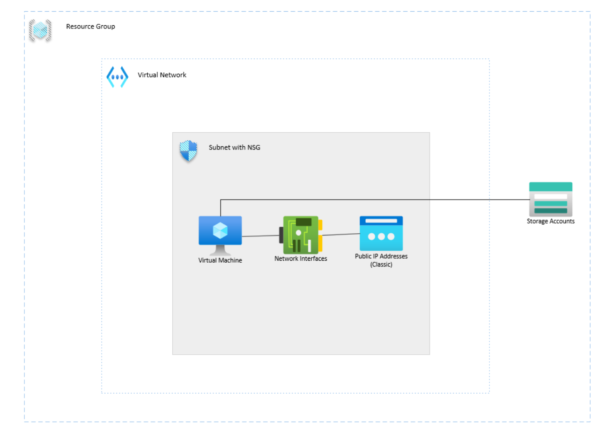

We're going to divide this demo into 3 sections:
* Configuring Azure for Terraform
* Breaking down Terraform Blocks
* Testing the deployment via the VM

## Configuring Azure for Terraform

So lets hope into our sandbox environment and get Azure ready for the Terraform deployment. Now, I'm using the A Cloud Guru (ACG) sandbox and I want to note that we can not create Resouce Groups (RG) in this environment which is why I skipped that step. Actually, I created a RG block in my file but it would break the deployment since I technically can't do that in the sandbox. Simple mistake but it was corrected. Just be aware of this for prod deployments. 

Get an Azure Cloud Shell environment fired up. We're going to use Bash. Choose `East US` as the location since that's where our Terraform files have our locations set to. Feel free to change it but you'll have to change the region in the file as well. So create a storage account and a file share. Then you should be in. 

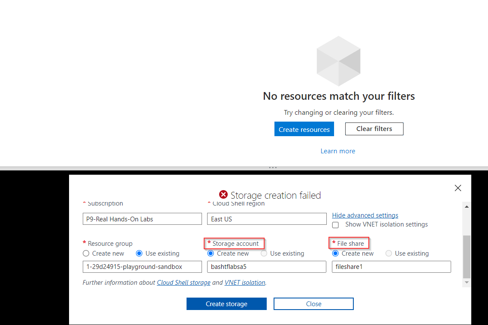

Now, we need to create the `main.tf` file and, in our case, the `azureterraformdeploy.tf` file. I'll explain why in the next section of our demostration what I believe the reasoning is for these two files. But these will be the files we'll need. The bash command for creating files is `touch` followed by the file name and extension. 

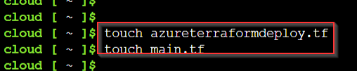

To put information inthe file, use `code` followed by the file to open the file the File Editor. Lets start with `main.tf`. I have uploaded both files to this GitHub repo so you can either copy and paste the contents into this editor, click upload files within the Azure Cloud Shell (ACS) environment, or you could use `git clone branch` I believe to copy the files directly from GitHub to Azure. Either way, lets get the `main.tf` file and it's contents created in the ACS. Use `Ctrl + S` and `Ctrl + Q` to save and exit out of the File Editor. 

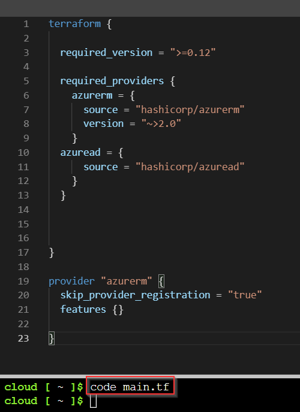

We'll do the same exact process for the `azureterraformdeploy.tf` file.

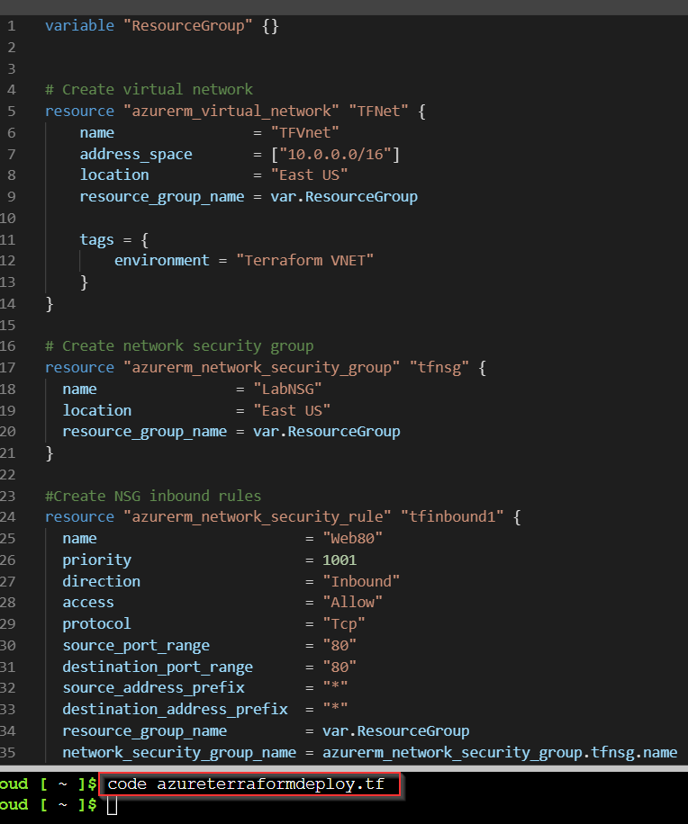

We can use `ls` to see the files in our directory just to doublecheck everything is there. 

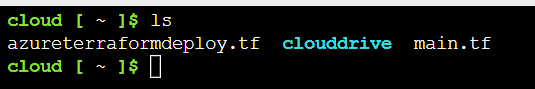

Now, for the fun part. Lets initialize Terraform so that we're able to use it. I believe Terraform is natively built into the ACS so we don't have to download anything. We just need to get it started. Use `terraform init` to do this. 

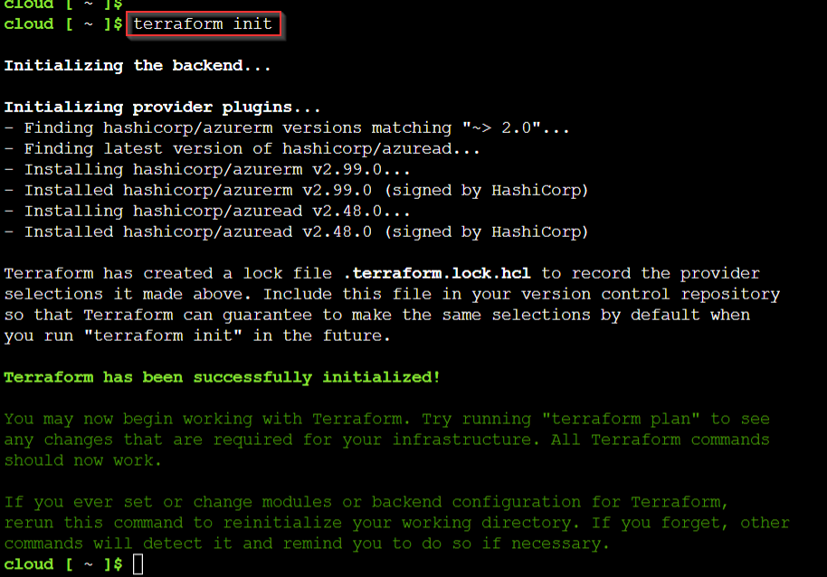

Once that's completed, we'll use `terraform plan` to allow ACS to show us what Terraform plans on doing once we deploy it. I created a variable for our RG to make the deployment easier so once I was prompted with that, I entered in the RG for our new sandbox environment. I did this because for the sandbox, the RG name changes every time. I didn't want to go into my code to change the RG although there is a very convenient way to do this. You can highlight the RG, right click and press "Change all Occurrences" and it will change the RG name everywhere in the file. But anyway, the variable choice was more convenient. 

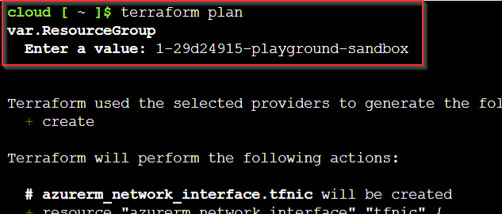

You can also see at the bottom what Terraform plans to do. We're adding 15 resources, doing 0 changes, and destroying nothing. Do this as a check to make sure your deployment is exactly what you want it to be. It's like a best practice from what I was told. 

Now, if everything looks good, we can actually deploy our resources. Use `terraform apply` to deploy all the resources. For our code, you'll need to enter the RG again. 

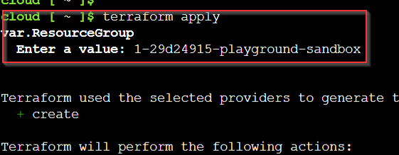

After that's done, enter in `yes` when prompted with a value and your deployment is on its way! If successful, it will tell you the apply was complete and how many things were added, changed or destroyed. Also, take note of the amount of time it took to create that VM. 48s is FAST. It took maybe a minute and a half to deploy all of these resources.

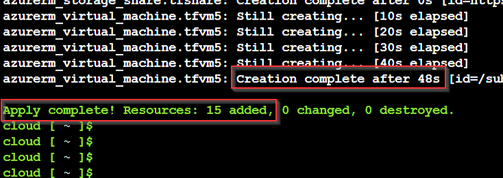

So, before the deploy, we only had a storage account for our Bash session that didn't even populate in our RG. 

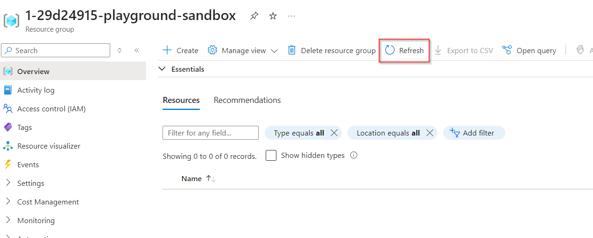

After our deployment, we have ALL the resources listed in the beginning of this demo! How cool is that??

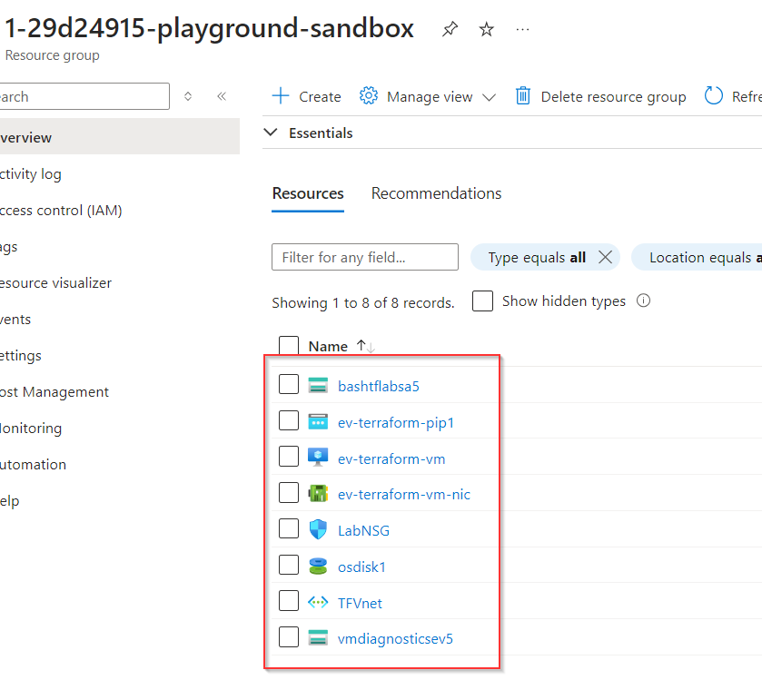

## Breaking down Terraform Blocks

So, before we test if our deployment was fully operational, I want to break down the Terraform files and blocks from a beginner perspective.

